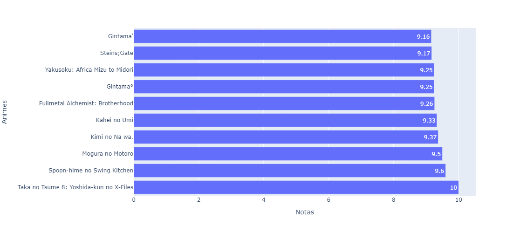
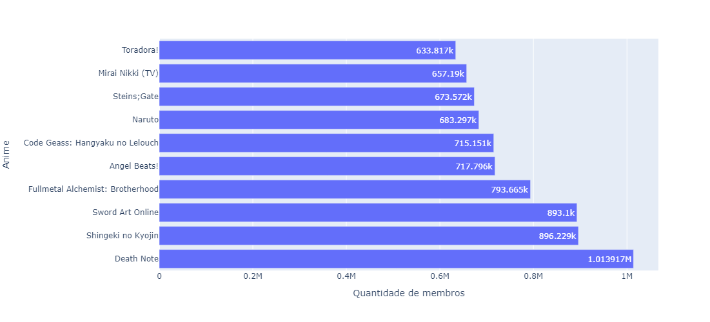
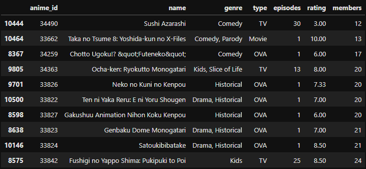
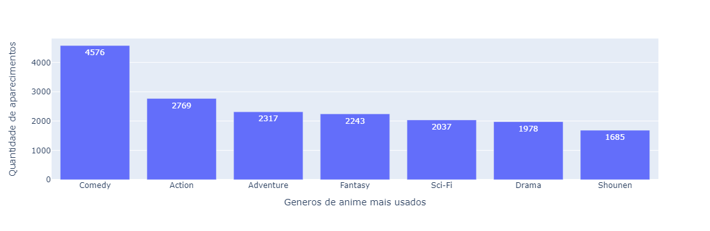

# Análise de dados de público de anime

> Situação:

Uma empresa contratou seus serviços e queria que você analisasse os animes que a plataforma possui, pois seu contratante gostaria de remover os animes com menores visualizações / membros, e enfatizar animes com os melhores públicos, também saber o tipo de gênero que o público mais gosta

> Então

Esse projeto tem como intuito analisar um banco de dados e retornar valores referente aos animes nele listados e extrair informações como:

- Notas deles
- Quantidade de membros ou pessoas que assistiram
- Melhores Animes e piores 
- Fazer gráficos para exibir essas informações de forma visual


## Iniciando Ambiente

### 1º Baixar python

- [Link para download](https://www.python.org/downloads/)

<br>

### 2º Baixar o Jupyter

```
pip install notebook
```
- Iniciar Notebook
```
jupyter notebook
```
<br>

### 3º Baixar pandas

- Usado para ler e manipular com base de dados
```
pip install pandas
```

<br>

### 4º Baixar o plotly

- Criador de gráficos com python

<br>

## Considerações 

A partir daqui você vai seguir para esse arquivo (após iniciar o jupyter digitando `jupyter notebook` no terminal) lá vai ter o projeto pronto caso você queira ver como eu fiz

## Imagens

### Gráfico dos gêneros de animes


### Gráfico das melhores notas



### Gráfico dos mais assistidos



### Tabela dos menos assistidos



### Gráfico dos gêneros mais usados



### Gráfico dos gêneros dos animes mais assistidos


<br>

> Se quiser ver as imagens melhor:
- [Clique aqui](./src/img/)
